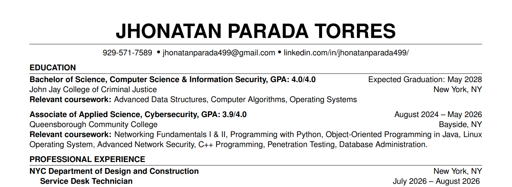

# Resume
Repository to version-control Latex resume.  
Previously was using the [Overleaf Sync with Git](https://github.com/marketplace/actions/overleaf-sync-with-git) action to sync changes from [Overleaf](https://https://overleaf.com). Now, Latex compilation and preview is performed locally.  

## Quick Setup
### Dependencies
```
sudo apt install texlive-latex-base \
	texlive-latex-recommended \
	texlive-latex-extra \
	texlive-fonts-recommended \
	latexmk
```

### build Command from Root Dir
```
latexmk -cd overleaf_remote_src/resume.tex -outdir=../build
```

  

Last cookie extracted in August 18, 2026  
